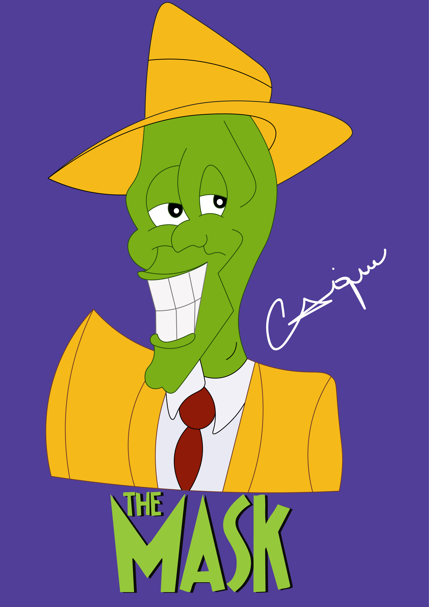
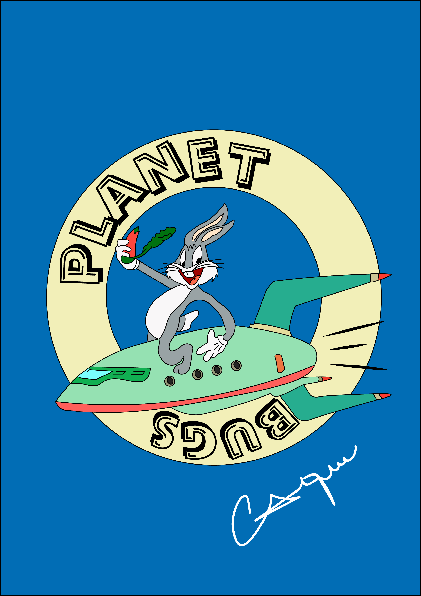
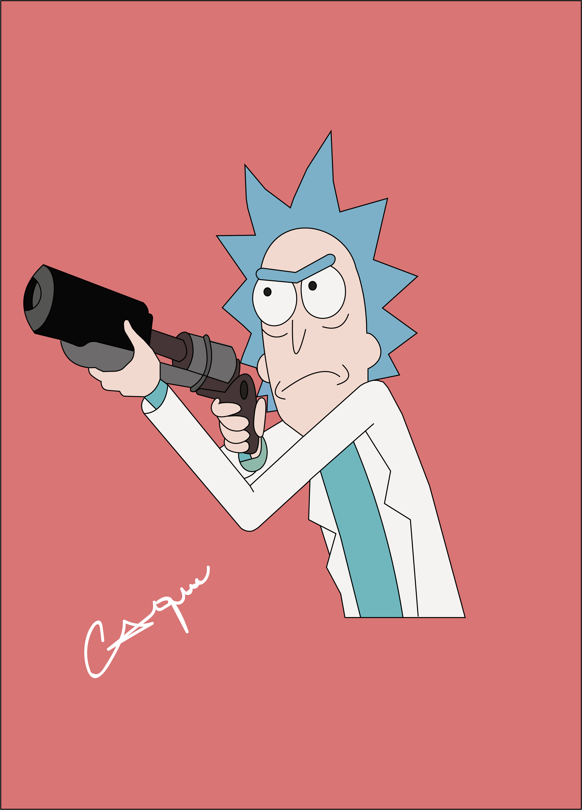

<h1>Meus Projetos de Vetorização</h1>

O Adobe Illustrator é uma das ferramentas mais poderosas e amplamente utilizadas no campo do design gráfico,um dos principais usos do Illustrator é a criação de ilustrações vetoriais,sua versatilidade e recursos avançados permitem a criação de uma variedade de projetos de desenhos que vão desde ilustrações simples até composições complexas. Nesse repositorio exponho alguns dos projetos de minha autoria.

<h2>Linguagens e Bibliotecas Utilizadas</h2>

  

<h2>Resumo do Projeto</h2>

 

 

